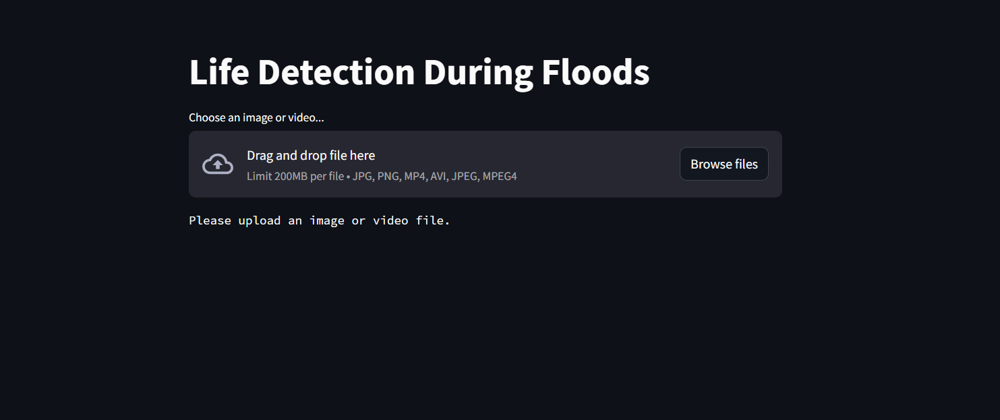
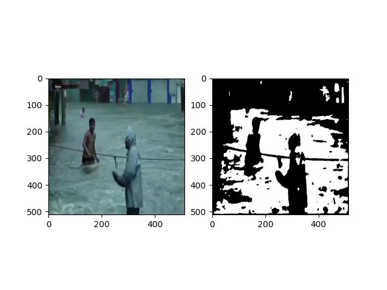
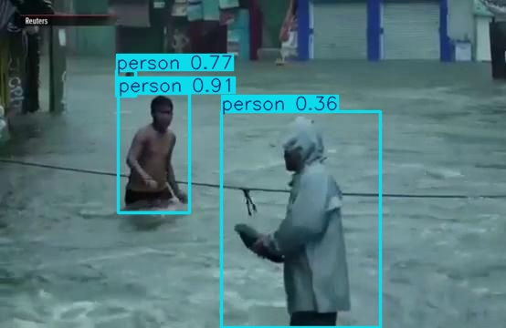
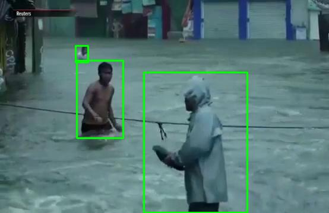

# Life-Detection-During-Floods

AI-based system to detect humans inside flooded regions using Deep Learning.

This project combines:

UNet – Flood Water Segmentation

YOLOv8 – Person Detection

Fusion Logic – Identifies people inside flood area

Streamlit – Web Application Interface

## Project Overview

Flood disasters create life-threatening situations.
This system automatically:

Segments flood water area

Detects humans in the scene

Identifies if a person is inside the flooded region

The goal is to support rescue and disaster management operations.

## Result

### Input Image

### Flood Segmentation

### Person Detection

### Final Output

